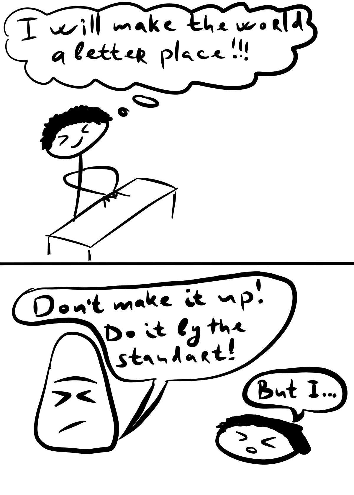

Well, it’s time to write a little about business and money and everything I love so much. At the end of the article, I’m gonna throw in a few ideas for business at home during all this quarantine craziness.

## Briefly about business in Russia

Nassim Nicholas Taleb wrote such a book called “Skin in the Game” in Russia it’s translated as “Risking with your own skin”. I haven’t read it myself yet, and in general I’ve only read “Black Swan” and “Antifragility” from Taleb, but judging by the title – a book directly about Russia. Every businessman in Russia “risks his own skin”, even if he has a simple coffee shop. Businessman faces many dangers: tax authorities, various regulatory bodies, police, firefighters, and in general, ALL who have any power. This is very strange, because the authorities should not behave like this, right? Yes, but it turns out the other way round. Why do we have so few companies working “in white” and paying taxes. It’s because of the stupid system!
It’s impossible to earn a lot of money honestly in Russia. How many companies like Google, Amazon, Apple, Samsung do you know from Russia? I don’t know one. All our “property” is stupid oil and gas, which are pumped out by corrupt creatures.
In Russian business, everything is decided by connections, acquaintances, kickbacks, and this is it. Corruption is our “main business”! People’s business, you could say. Eh, I’m back to bad things.

## The Competition

Talk about competition. It’s important, isn’t it? Who thinks what?
Personally, I think that competition is an engine that pushes progress, but lately everything has broken down. The example of Apple and the new iPhone (11), has something radically changed? No… The new SE iPhone? What?! You’re just collecting money for an old device in a new wrapper. Where are the AR (augmented reality) glasses? Where are the tags? Where are all your Apple promises?! You have huge funds to drive progress not only in the electronics market, but in the world in general.
By the way, is competition in Russia? That’s crazy. Whoever has better connections wins in our “competition”. The rest of us are going to jail.

## What am I doing?

This blog, I think, should turn from a blog about “How bad is Russia” into a blog about “I’m getting out of here soon”. Like a diary of a man who has nothing, but is trying to get out of all this darkness. Some kind of experiment? Then I think I should enter some initial data in the next post. Well, for the experiment to be more real. What do you think?

_I will make this world a better place!_
So far I’ve decided to try my hand at freelance, but look for orders abroad. I’ve decided to start with Fiverr. I wonder if there’s as much competition as anywhere else.

My text is very bad there, it needs to be corrected somehow… We need to think about it…

So this is about business ideas from home. She’s alone and very simple. Think about what you can do and offer a service online. That’s all…)

P.S. I can make a website for feedback if any of you need=)
