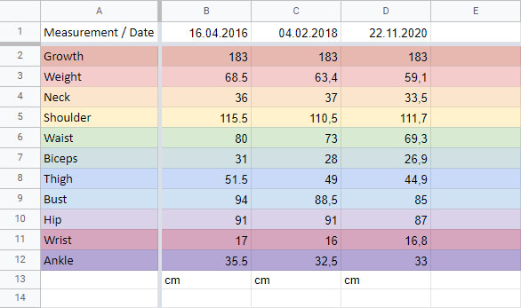

This will be a short post, and I’ll do the blog (as much and as often as possible) after I redesign it. I think that will be in 2021. Although, of course, I will write a year-end post.

The year is ending and my progress in gaining weight is still as sad as ever.
Here’s a spreadsheet of my measurements for 2016, 2018, and this year.

_Damn!_

More specifically, what’s left of last year. I lost weight!!! I need to gain weight, not lose it… Holy crap!

I don’t eat enough? I always eat until satiated, most of the time it’s a healthy food, no fast food, etc.
I work out, though not much so far. But it’s better than sitting and doing nothing.

Eventually, I realized that I would have to go back to counting calories, at least in some way. It’s dumb, it’s annoying and I hate doing it, but there’s no other option. I’m going to start at 2,650 kcal a day and see what happens to me at the end of this year.

I need to make a meal plan so I don’t have to count every time and just take the right portion and eat. I think I’ll get into that tomorrow, but for now, I’m off to dinner.:)
