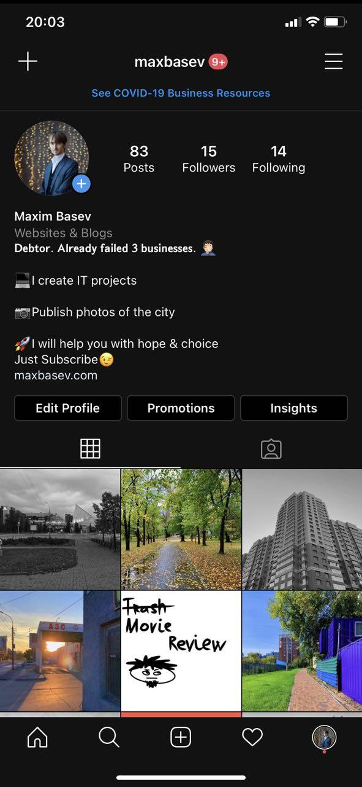
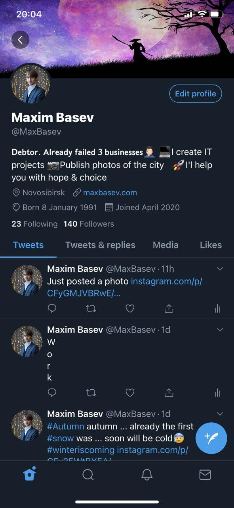

I think you have already noticed – there were no posts from me this week. Apparently, it is because I am a “lazy bun”… Or maybe it’s a prokrastination? It is necessary to understand the difference of these terms at leisure.
Well, now, Mini Notes #3.

## My life

Well, what can I say, my wife and I started to collect documents for one of the two bankruptcy procedures, I think that the first procedure will be all right. But I have more and more problems every day.
Even in the last days I learn a lot about programming, as I remember the old knowledge, as well as learn the new one. I even get certificates for such simple things as HTML and CSS, it’s not difficult to get them, and the benefits, although minimal, are there.
Plus I do different projects, communicate in Slowly (I met a funny man from Forester City, hello Alex!) and sometimes play in Hearthstone with my wife.
Perhaps that’s all about me so far.

## Personal brand

Yesterday I watched a webinar about personal brand development from scratch. As I thought, my main problem is that there is no specific topic. My blog is boring to read, if you do not know me personally, ie all those who just go into my social networks or my blog – my posts seem to be notes crazy. With this you need to do something, and to do this you need to answer the question. What can I do for people? What can I do for you specifically?
For example, in my Instagram and Twitter I updated my profile like this:

_Instagram_

_Twitter_

Maybe you can give me some advice?

I really do my IT projects. And I like to take photos. I’m not sure about the last line, because if my stories will really inspire someone, rather the opposite. But so far nothing else comes to mind.

Well, that’s probably all for today. The notes are really “Mini”.:)
