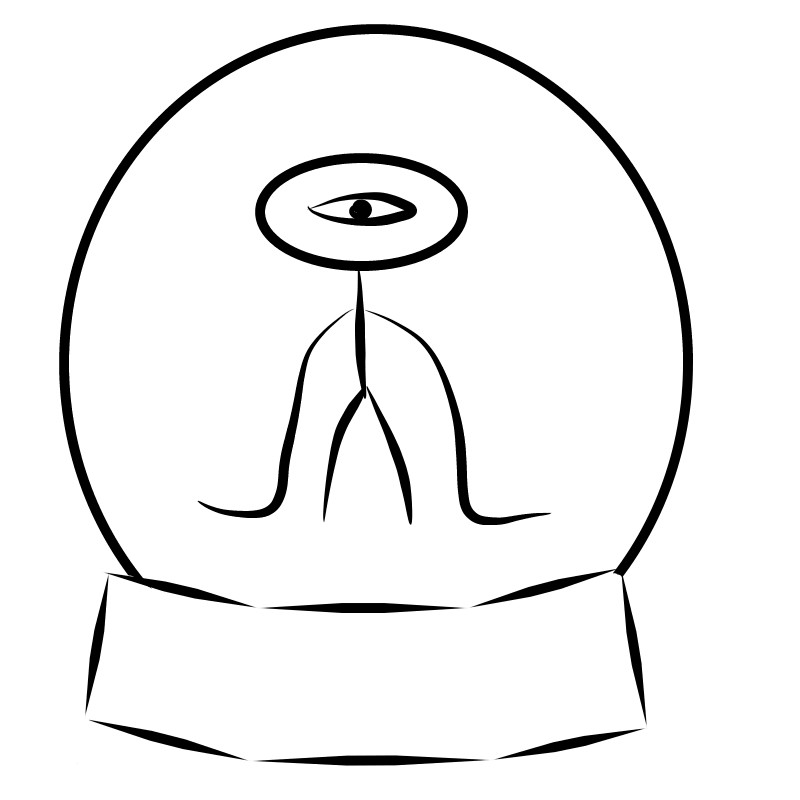
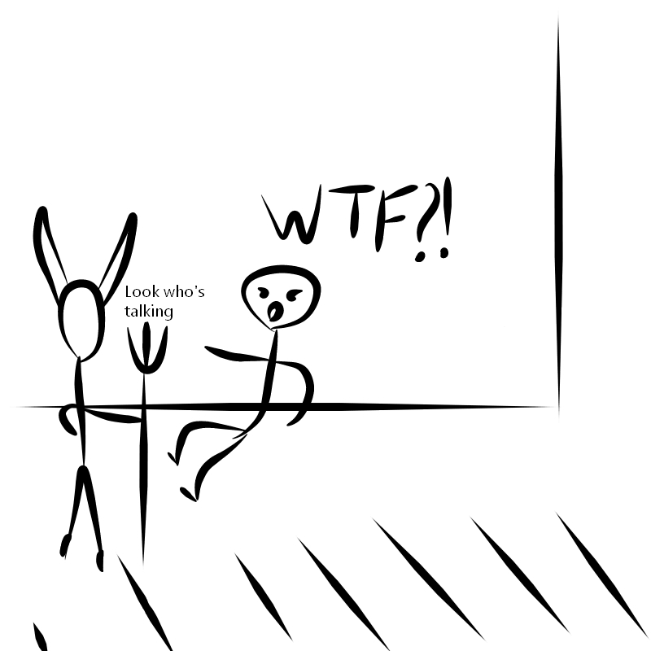

A little clarification. At one time I took a course in writing skills, imagination and all that. There was an assignment to send in some emojis and then write a story based on that row of emojis.

_That's what the row was._

## And here's what came out.

The Devil sat on his throne in hell as usual .
— Have you lost your minds there in lava? What is a bullshit about aliens?
— Your evilness... — spluttered imp. — It's the 5th soul already, which the aliens incinerated by a laser, what's the point for them to lie?

-Hmm, right, it doesn't make much sense. - thought the Devil. - Alright, get out, I'll see what's going on out there.

Turning on his specular seer, the Devil stared at the screen. It was night in the city, streets were empty and even the lights were turned off for some reason. Having looked through images of the streets, the Devil had already decided to turn off the seer, but then his attention was attracted by a luminous elongated silhouette at one of the windows.

"What is that thing?" - muttered the Lord of Hell, peering at the screen. There really was a "thing": an elongated silhouette, all as if doused with phosphorus, instead of a head there was a ball, and its arms, disproportionately long relative to the whole body, dragged along the ground.

"Dang it! It is really an alien! — The devil began to dress quickly - This alien will provoke a commotion in the Hell by souls of people gone crazy."
Gathering up and taking a pitchfork with him, the Lord of Hell grunted a spell and teleported to the city.

At the same time Arseny was heading home, his thoughts were gloomy: "I am late today, and there are murders happened in the city, 5 at a time, what if i meet a ghoul now what i am going to do then?" Turning the corner, Arseny froze. There was an alien.

"Damn it! What a day?! - slowly Arseny began to back away, - A Ghoul, a ghoul! How! A ghoul from space, yeah ... If only he did not noticed me!" Continuing to back away, he suddenly felt that he step into something warm and hard enough.

-Human, are you even looking where you are going? Do want to get to hell early? - The Devil was in a bad mood, the teleport missed a little and he had to run two blocks - Run away from here while you can! - then he noticed a bow tie on Arseny's neck - Although, wait, give me your tie.

Pale Arseny, all trembling, somehow pulled off his tie from his neck, throwed it to the Devil and rushed away.

-Alright, that's was a lucky one, I forgot a rope - muttering another spell and lengthening the tie up to several meters, the Devil went to the alien - Hey, dear! Hold on a little!

Donald, dressed in the suit of an alien, stood by the window of the house and peered into the darkness of the room. Something was wrong, the inhabitant of the apartment should have already been at home, but there was no light. "Where the hell she is ?!" muttered the alien. "I've been on ambush for a week! But it's no use!" - Suddenly he heard a call behind him.

Turning around, Donald only yelped, in front of him stood a tall devil with horns and very muscular arms.

-So you are the alien who sends in hell for me souls of people gone crazy? - The devil threw a lasso made of the tie on the alien and continued, - Why in the world you have came to Earth, m? Where are you from? Do you even understand our language?

-I-I-I am D-d-d-d-donald. I-I-I am N-n-n-not an alien. I-I-I am a human! - babbled stammering Donald. - P-p-please have mercy!

-What?! Then who killed 5 people by a laser? Don't try to fool me around! The souls have told me everything about you and stop shaking - you pisses me off!

-I-I-I know nothing about l-l-l-laser. There happened 5 deaths in the city and everything was in the fire at the laser show!

-That's what I am talking about! By a laser! - The devil has already begun to understand that something is wrong here, - How do you know about the corpses?

-I-I-I work as a pathologist, - Donald was still shaking, - all corpses pass through me.

-Dang it ... What a day! - The devil hit the ground with the pitchfork - So in short, i am confiscating the suit, and you going home. And if I ever again hear from souls about aliens armed with lasers, you will go to hell ahead of schedule, even if heaven is promised to you. Do you understood me?

-S-s-sure - Donald started stuttering again. Having pulled off the suit, he remained in a leotard and an undershirt.

-Hmmm, you looked better in the suit ... - muttered the Devil. - Who gave birth to you? - Outwardly, Donald was far from handsome, a beard that was never combed, round horn-rimmed glasses and a huge bald patch covered with ulcers.

-Get out - said the Lord of Hell, picking up the suit.

One more spell and the Devil was sitting on his throne again: "I should call imps, let them make a stuffed animal out of the suit. It's kinda a trophy from a hunt ..."
