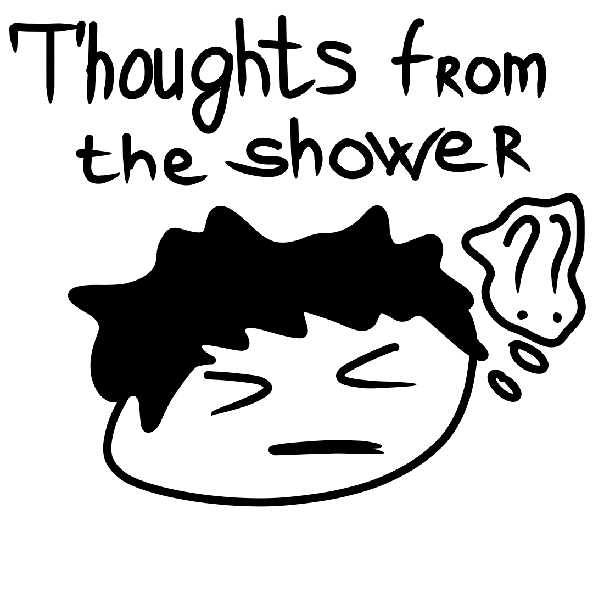
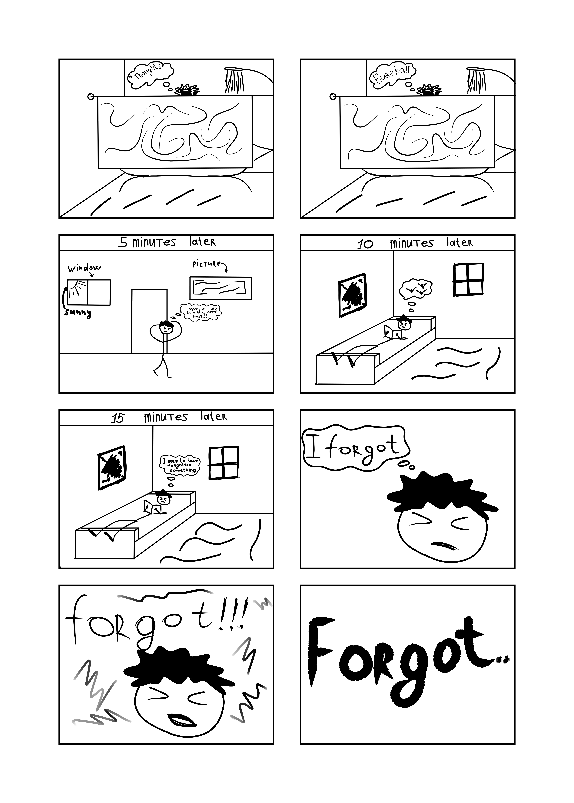

> When you take a shower, sometimes you get such brilliant ideas that you can immediately hope for the Nobel Prize. It’s a shame I forget them right away.

Here’s the deal. I was taking a shower. It was unexpected, wasn’t it? And I had an idea in my head, but I naturally forgot it. It’s sad. I should’ve written it down right away… So I decided to add a section like that to my blog in English. “Thoughts from the Shower”, in Russia this phraseology is quite popular.

## What are “Thoughts from the shower”?

A shower is one of the few places where we can get some privacy and give our minds a chance to relax and disconnect from trouble. When thoughts switch to something else, at the most unexpected moment, brilliant thoughts like these may come to us.
Recently, it has become particularly popular to share your insight, even in individual forums and groups. Some thoughts may be meaningless, others incredible or just funny.

As a result, I called this section “Thoughts from the Shower”.
I was bored and my crooked hands tried to depict it in a small сomic strip…

Small comic strip “Thoughts from the shower”…
Have you ever had any interesting thoughts while taking a shower, or maybe you have found an answer to a question that has long tormented you?

## But still. Why is this happening?

Above I have already written a simple reason, and I think it is necessary to ask psychologists for details? Or in neurobiology? I don’t know. Anyway, the way to find an answer to a question is not bad, even pleasant.

> The answer to a question that torments you for a long time may come not only in your sleep, but also in your shower.
